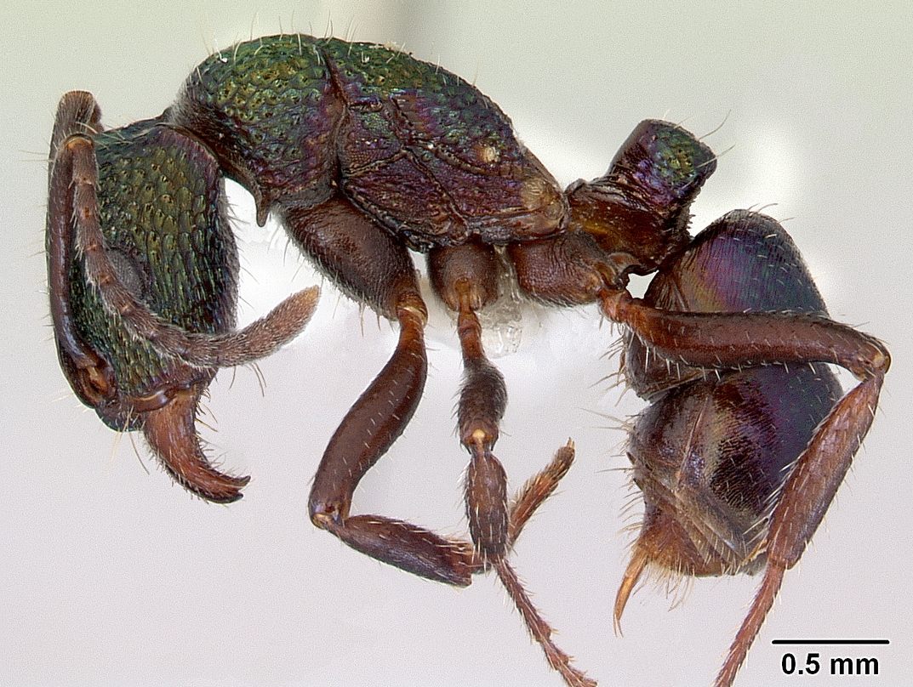

# tfcb-homework01 

This is homework01 for course [Tools for Computational Biology](https://github.com/FredHutch/tfcb_2022)
## Source Code 
1. main.py
1. get_dataset.py
1. get_species_list.py
1. predict_image.py

## Images 

## Data

The data table contains columns: data_collection, species, sex, weight. Each row is information collected from the same date. 

Here is an example: 
| data_collection | species | sex | weight| 
| --------------- | ------- | --- | ----- |
| 2014-07-13      | DM      | M   |  40   |
| 2014_09-10      | DS      | F   |  50   |